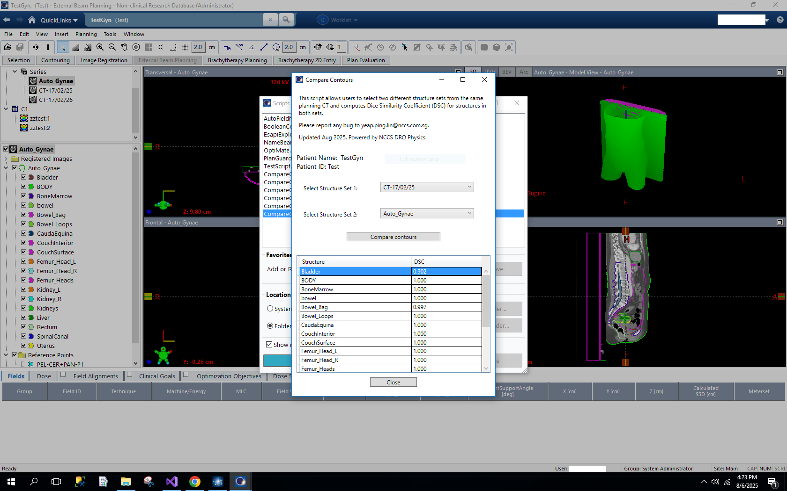

# ESAPI Dice Similarity Coefficient Calculator

## Overview
This ESAPI (Eclipse Scripting API) script calculates the **Dice Similarity Coefficient (DSC)** between structures with the same name across two structure sets on the **same planning CT**.  
The DSC is a widely used metric for quantifying the spatial overlap between two volumes, where:
- **1.0** indicates perfect agreement  
- **0.0** indicates no overlap

The script:
- Retrieves matching structures by name from the current patient’s active plan.
- Computes intersection and union volumes by sampling points within their combined bounding boxes and checking 'volume.IsPointInside(x,y,z)'.
- Calculates the DSC for each matching pair.
- Displays results in a table within the GUI.

## Safety
⚠ **Read-only operation:**  
- The script **does not modify** any patient data, plans, or structure sets.  
- It uses the patient context in read-only mode.
- Added safety check: script will only run if patient context is valid.

## Features
- **Automatic structure matching** by name.
- **Grid-based Dice calculation**.
- **GUI table display** with scrollable, wrapped text.
- **Retrieval of metadata** such as:
  - Patient name
  - Patient ID

## Requirements
- **Eclipse Scripting API (ESAPI)** access.
- Appropriate Varian ARIA/Eclipse user privileges to run scripts.
- Built and run within the Eclipse v17 TPS environment.

## How It Works
1. Retrieves two user-selected structure sets from the active plan.
2. For each structure name found in both sets:
   - Creates a combined bounding box of the two volumes.
   - Samples points within a grid inside the combined bounding box.
   - Checks if point is within both volumes (intersection) or one of the volumes.
   - Computes DSC by calculating number of points in intersection divided by number of points in both volumes.
3. Populates results into a table.
4. Displays GUI, with option to sort by structure or DSC score.

## Example Output
| Structure Name | DSC              | 
|----------------|------------------|
| Bladder        | 0.92             |
| Rectum         | 0.89             |

## Usage
1. Load the script in Eclipse under **Scripting**.
2. Open a patient with a plan containing at least two relevant structure sets.
3. Run the script from the scripting menu and select two structure sets.
4. View results in the displayed table or copy to Excel.

## Limitations
- Only works when **both structure sets are on the same planning CT**.
- Structures must have **exact same names** to be compared.
- Requires ESAPI environment; cannot be run standalone.

## Screenshots

### GUI Interface and Results Table

## Versioning
| Version | Date       | Author  | Notes                                  |
|---------|-----------|---------|----------------------------------------|
| 1.0.0   | 2025-08-15 | PL Y    | Initial release with GUI and table |

## Reporting Issues
If you find a bug or have suggestions for improvement, please email:  
📧 **yeap.ping.lin@nccs.com.sg**

When reporting an issue, please include:
- Script version
- Eclipse TPS version
- Brief description of the problem
- Steps to reproduce

## License
Internal research use only. Not for clinical use or commercial distribution.
